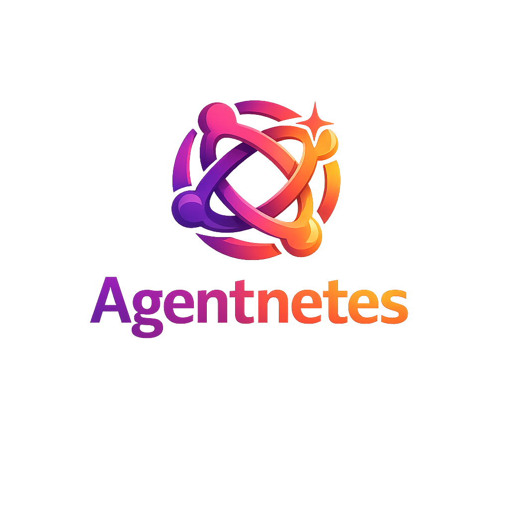

<div align="center">



# Agentnetes

**Zero to a Self-Organizing AI Agency. On Demand.**

*k8s orchestrates containers. a8s orchestrates AI agents. · built at Zero to Agent London 2026, Google DeepMind x Vercel*

<br/>

[](https://shashikant86.github.io/agentnetes/)
[](https://shashikant86.github.io/agentnetes/demo)
[](https://www.npmjs.com/package/agentnetes)
[](https://www.npmjs.com/package/agentnetes)
[](LICENSE)
[](https://shashikant86.github.io/agentnetes/docs)

<br/>

[](https://www.youtube.com/watch?v=8nPDgC30U38)

**Watch the demo** (2 min)

</div>

---

## Quickstart

**Step 1** · Get a free API key at [aistudio.google.com](https://aistudio.google.com)

**Step 2** · Pull the Docker base image (one-time)
```bash
docker pull node:20-alpine
```

**Step 3** · Run on any git repo
```bash
cd your-project
GOOGLE_API_KEY=your_key npx agentnetes run "add comprehensive test coverage"
```

No install needed. Works on any git repository with a remote `origin`.

> Full docs at [shashikant86.github.io/agentnetes/docs](https://shashikant86.github.io/agentnetes/docs)

## Install

```bash
# Run instantly with npx (no install needed)
npx agentnetes run "your goal here"

# Or install globally
npm install -g agentnetes
agentnetes run "your goal here"
```

---

Type a goal. Agentnetes assembles a team of specialist AI agents, each running in an isolated sandbox, that explore your codebase, write code, run tests, fix failures, and deliver together. No hardcoded roles. No sequential bottlenecks. No files stuffed into prompts.

---

## CLI

```bash
# Run on the current git repo (no install needed)
GOOGLE_API_KEY=your_key npx agentnetes run "add comprehensive test coverage"

# Or install globally once
npm install -g agentnetes
GOOGLE_API_KEY=your_key agentnetes run "add dark mode"

# Pre-warm a sandbox snapshot for faster runs (Vercel sandbox)
npx agentnetes snapshot create

# Start the web UI on localhost:3000
npx agentnetes serve
npx agentnetes serve --port 8080
```

---

## What is it

**k8s orchestrates containers. a8s orchestrates AI agents.**

Agentnetes (a8s) is a self-organizing swarm of AI agents. Just as Kubernetes (k8s) orchestrates containers across a cluster, Agentnetes orchestrates AI agents across isolated sandboxes. Same ideas: declarative goals, parallel execution, lifecycle management, isolation. Applied to AI agent teams instead of workloads.

You give it a single natural-language goal and a codebase. The system:

1. Spawns a root orchestrator (the Tech Lead) that explores the repo and invents a specialist team
2. Specialist agents run concurrently, each in their own isolated sandbox
3. Agents collaborate at runtime when findings from one affect another
4. All artifacts are collected, verified, and streamed back to you

Roles are fully emergent. Nothing is hardcoded. A provider implementation task gets a Scout, Engineer, Tester, and Packager. A security audit gets a completely different team.

---

## vRLM: The Orchestration Runtime

vRLM (Virtual Recursive Language Model Runtime) is the core engine inside Agentnetes. It is the layer between your goal and the actual agent execution.

Inspired by the [RLM pattern from MIT CSAIL](https://arxiv.org/abs/2512.24601): instead of loading the codebase into an LLM prompt, each agent gets a **virtual environment** (an isolated sandbox with the repo already cloned) and explores it using real shell commands.

### Three phases

**1. Plan**
A root agent (the Tech Lead) calls the Gemini planner to decompose the goal into a set of specialist worker roles. Roles are fully emergent: the planner decides what skills are needed based on the goal and repo structure. Nothing is hardcoded.

**2. Execute (parallel)**
Workers run concurrently. Each worker gets:
- An isolated Docker container (or Vercel Firecracker VM) with the repo pre-cloned at `/workspace`
- Two MCP tools: `search(pattern)` to grep the codebase and `execute(command)` to run any shell command
- A role-specific system prompt built from the task description and accumulated findings from other agents

**3. Synthesize**
When all workers complete, the root agent reads their summaries and produces a structured report with findings and generated artifacts.

### Event streaming

Every phase emits typed events over SSE. The web UI subscribes to these to render agent activity in real time:

```typescript
type VrlmEventType =
  | 'task-created'    // new agent spawned
  | 'task-updated'    // status change or progress
  | 'task-completed'  // agent finished with findings + artifacts
  | 'task-failed'     // agent error
  | 'finding'         // agent discovered something
  | 'terminal'        // shell command + output
  | 'artifact'        // file produced by an agent
  | 'collaboration'   // inter-agent finding shared
  | 'synthesis'       // root agent final summary
  | 'done'            // run complete
  | 'error'           // runtime error
```

### Config

```typescript
interface VrlmConfig {
  maxWorkers: number;        // max parallel agents (default: 6)
  maxStepsPerAgent: number;  // max tool calls per agent (default: 20)
  plannerModel: string;      // model for root orchestrator
  workerModel: string;       // model for specialist agents
  repoUrl: string;           // git repo to clone into each sandbox
  sandboxProvider: 'docker' | 'local' | 'vercel' | 'e2b' | 'daytona';
}
```

---

## The Five Foundations

### 1. RLM Pattern ([MIT CSAIL](https://arxiv.org/abs/2512.24601))

Context lives in sandboxes, not prompts. Agents do not receive hundreds of files in their context window. Instead they write small shell commands to explore the codebase:

```bash
grep -r "LanguageModelV1" packages/ --include="*.ts" -l
find packages -name "package.json" -maxdepth 2
cat packages/provider-utils/src/types.ts
```

This keeps token footprints tiny regardless of codebase size.

### 2. AutoResearch Loop ([Karpathy](https://github.com/karpathy/autoresearch))

Agents do not write code and hope. They write code, run tests, measure results, and loop:

```
write code -> run vitest -> check failures -> patch -> repeat
```

### 3. Two-Tool MCP Strategy

Each agent has exactly two tools:

- `search(pattern)` · grep the codebase for patterns
- `execute(command)` · run any shell command in the sandbox

~1,000 token footprint regardless of task complexity.

### 4. A2A Protocol

Every agent Agentnetes spawns generates a standard A2A Agent Card:

```json
{
  "name": "Provider Engineer",
  "description": "Implements LanguageModelV1 interface for a new AI SDK provider",
  "capabilities": { "streaming": true },
  "skills": [{ "id": "implement-provider", "tags": ["typescript", "ai-sdk"] }]
}
```

### 5. Kubernetes-inspired Load Balancing

All specialist agents run concurrently. Work is load-balanced across the agent pool automatically. One agent failing never blocks the others.

```typescript
// Fault-tolerant parallel dispatch: same idea as Kubernetes workload scheduling
await Promise.allSettled(
  workerTasks.map(task => runWorker(task))
);
```

`maxWorkers` caps concurrency like Kubernetes resource limits on a node. `Promise.allSettled` ensures a failing Engineer never kills the Scout or Tester. The swarm delivers what it can regardless of individual failures.

---

## Architecture

```
You type a goal
       |
       v
  [Root Agent / Tech Lead]          Gemini 2.5 Pro
  Explores repo with grep/find
  Invents team
       |
  _____|_______________________________________________
  |           |                |                     |
  v           v                v                     v
[Scout]   [Engineer]       [Tester]           [Packager]
own sandbox  own sandbox   own sandbox        own sandbox
search()     execute()     execute()          execute()
```

---

## Tech Stack

| Layer | Package | Version |
|-------|---------|---------|
| AI Runtime | `ai` (Vercel AI SDK) | `7.0.0-beta.33` |
| Agent primitive | `ToolLoopAgent` | AI SDK v7 beta |
| Google AI | `@ai-sdk/google` | `3.0.52` |
| Sandbox (local default) | Docker `node:20-alpine` | - |
| Sandbox (cloud) | `@vercel/sandbox` Firecracker | `1.9.0` |
| Framework | Next.js App Router | latest |
| Planner model | Gemini 2.5 Pro (default) | configurable in UI |
| Worker model | Gemini 2.5 Flash (default) | configurable in UI |
| Models supported | Gemini 2.0 · 2.5 · 3.x | full lineup |
| Streaming | Server-Sent Events | native ReadableStream |

---

## Sandbox Providers

Agentnetes supports multiple sandbox providers. Set `SANDBOX_PROVIDER` in your environment:

| Provider | Env var | Notes |
|----------|---------|-------|
| `docker` | - | Local Docker containers. Default for local dev. |
| `vercel` | `VERCEL_TOKEN` | Vercel Firecracker microVMs. Auto-detected on Vercel. |
| `e2b` | `E2B_API_KEY` | E2B sandboxes. Install `e2b` package. |
| `daytona` | `DAYTONA_API_KEY` | Daytona workspaces. Install `@daytonaio/sdk`. |
| `local` | - | Runs directly on host machine in a temp dir. |

Auto-detection order: Vercel -> E2B -> Daytona -> Docker -> Local.

---

## Running locally

### Simulation mode (no API keys needed)

```bash
npm install
npm run dev
```

Set `SIMULATION_MODE=true` in `.env.local`. Visit `http://localhost:3000`.

### Real execution with Docker + Gemini

```bash
# 1. Pre-pull the Docker image
docker pull node:20-alpine

# 2. Get a free Google API key from aistudio.google.com

# 3. Create .env.local
SANDBOX_PROVIDER=docker
SIMULATION_MODE=false
GOOGLE_API_KEY=your_key_here
DEMO_REPO_URL=https://github.com/vercel/ai

# 4. Run
npm run dev
```

Each agent gets its own Docker container with the repo cloned inside. Containers are destroyed when the agent completes.

---

## Project structure

```
agentnetes/
  app/
    page.tsx              Landing page
    demo/page.tsx         Agent demo UI
    api/chat/route.ts     SSE streaming endpoint
  components/
    AgentPanel.tsx        Agent activity panel
    ChatPanel.tsx         Chat input
    ThemeProvider.tsx     Light/dark mode
  lib/
    gateway.ts            AI Gateway or direct Gemini
    vrlm/
      types.ts            AgentTask, VrlmEvent, Artifact types
      events.ts           VrlmEventEmitter
      runtime.ts          Real execution engine
      simulated-runtime.ts  Simulation fallback
      sandbox-manager.ts  Multi-provider sandbox lifecycle
      docker-sandbox.ts   Docker sandbox implementation
      local-sandbox.ts    Local shell sandbox implementation
      tools.ts            search() + execute() MCP tools
      prompts.ts          Planner + worker system prompts
    a2a.ts                A2A Agent Card generation
```

---

## Environment variables

```bash
# Sandbox
SANDBOX_PROVIDER=docker        # docker | vercel | e2b | daytona | local

# Google Gemini API key (get one free at aistudio.google.com)
GOOGLE_API_KEY=                # Set as env var or in .env.local. Not configurable in the web UI.

# Vercel sandbox (auto-detected on Vercel via OIDC)
VERCEL_TOKEN=

# Demo
SIMULATION_MODE=false          # true = always use simulation, skip real execution
DEMO_REPO_URL=https://github.com/expressjs/express  # default target repo
```

> **Tip:** Set `GOOGLE_API_KEY` as an env var before starting. The Settings modal lets you configure repo URL, sandbox provider, and models.

---

## License

MIT
